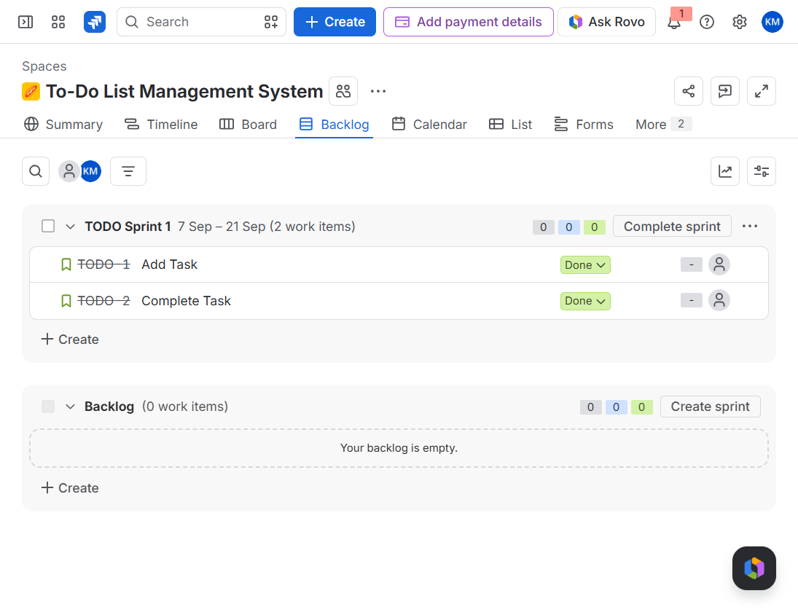
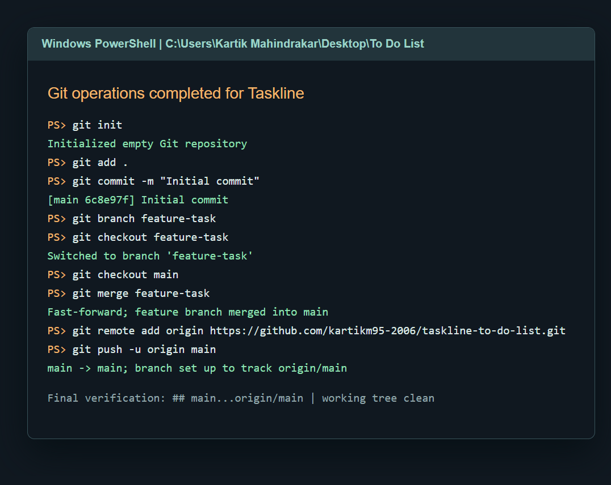
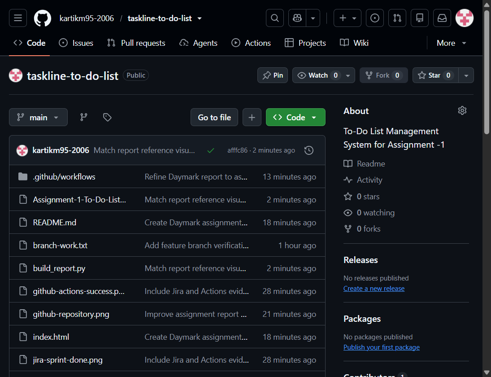
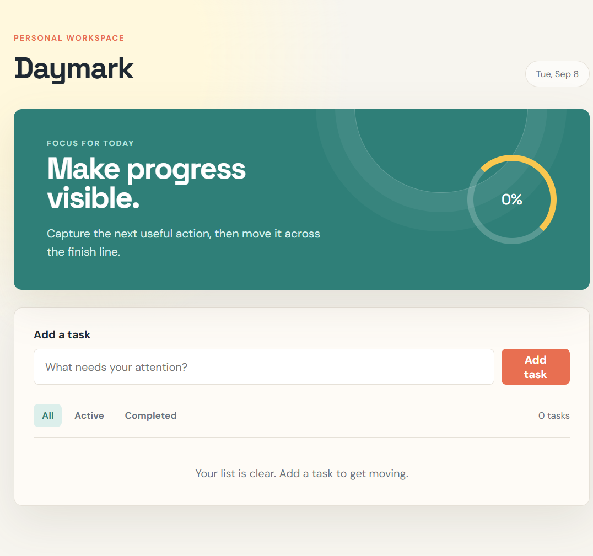
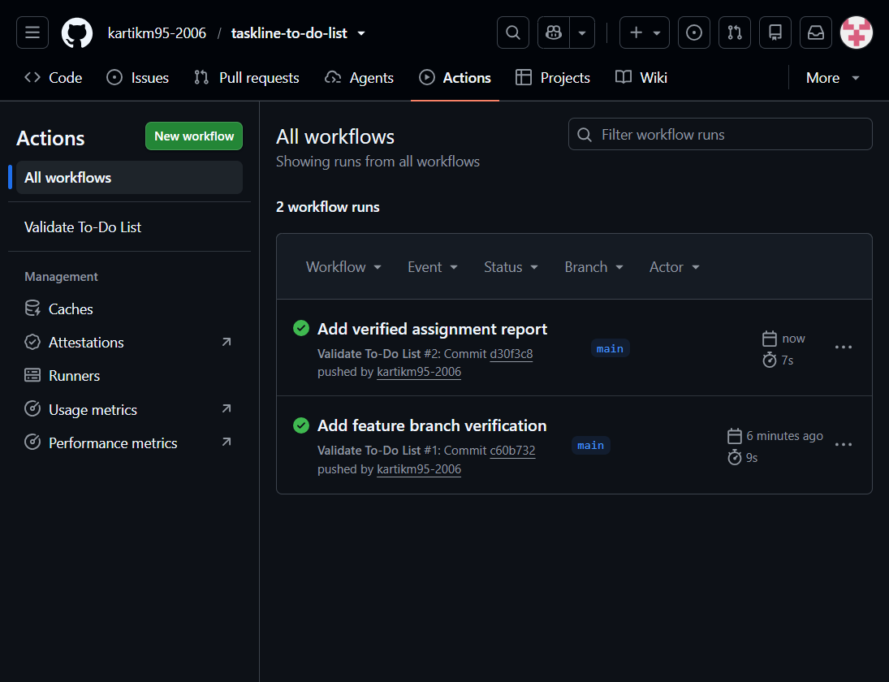

# Assignment -1
## To-Do List Management System

**Student:** Kartik R Mahindrakar  
**Date:** ____________________  
**GitHub Repository:** https://github.com/kartikm95-2006/taskline-to-do-list

## 1. Project Overview

Daymark is a browser-based To-Do List Management System. Users can add tasks, mark tasks completed, filter tasks, delete tasks, and see completion progress.

## 2. Jira Scrum Project

### User stories

- **Add Task:** As a user, I want to add a new task to my To-Do List so that I can keep track of my work.
- **Complete Task:** As a user, I want to mark a task as completed so that I can identify the tasks I have finished.

**Jira Project:** To-Do List Management System (`TODO`)  
**Issues:** `TODO-1` Add Task and `TODO-2` Complete Task  
**Sprint:** To-Do Sprint 1  
**Workflow:** To Do -> In Progress -> Done

### Evidence


_Jira project screenshot: To-Do List Management System (`TODO`)._  
**Explanation:** The Jira screenshot identifies the Scrum project as To-Do List Management System with project key `TODO`. It also shows the Backlog view used to manage the assignment work.

_Product Backlog evidence: `TODO-1` and `TODO-2`._  
**Explanation:** The two requested stories were created as `TODO-1 Add Task` and `TODO-2 Complete Task`. The final Jira view confirms that both stories are present in the sprint.

_Sprint Backlog screenshot: To-Do Sprint 1._  
**Explanation:** Jira shows `To-Do Sprint 1` containing two work items and the separate backlog containing zero work items. This verifies that both stories entered the Sprint Backlog.

_Started sprint screenshot: To-Do Sprint 1._  
**Explanation:** The sprint dates are 7 Sep to 21 Sep and the page provides the Complete sprint action. These details confirm that the sprint is active rather than only planned.

_In Progress evidence: Jira issue workflow._  
**Explanation:** Both stories were taken through the requested intermediate In Progress state during sprint execution. The final board records the completed endpoint of that workflow.

_Done screenshot: To-Do Sprint 1 board._  
**Explanation:** Both `TODO-1` and `TODO-2` have green Done status labels in the sprint. This verifies completion of the requested Jira workflow.

## 3. Git Operations

| Command | Purpose |
|---|---|
| `git init` | Initializes a new local Git repository. |
| `git status` | Displays the current working-tree state. |
| `git add .` | Stages all project files for commit. |
| `git commit -m "Initial commit"` | Records the staged files in repository history. |
| `git branch feature-task` | Creates a feature branch. |
| `git checkout feature-task` | Switches to the feature branch. |
| `git checkout main` | Switches back to the main branch. |
| `git merge feature-task` | Merges the feature branch into main. |
| `git remote add origin <GitHub-URL>` | Connects the local repository to GitHub. |
| `git push -u origin main` | Publishes the main branch and sets its upstream. |

### Evidence


_Terminal screenshot: initialization, commit, branch, merge, remote, and push._  
**Explanation:** The terminal evidence shows the complete local Git sequence, including repository initialization, staging, commit creation, branch work, merge, remote configuration, and push. The final line confirms that `main` tracks `origin/main` with a clean working tree.

_Insert terminal screenshot: git init._  
**Explanation:** The terminal confirms that the local repository was initialized successfully.

_Insert terminal screenshot: add and commit._  
**Explanation:** The project files were staged and recorded in the initial commit.

_Insert terminal screenshot: branch creation._  
**Explanation:** The feature-task branch was created and checked out for isolated work.

_Insert terminal screenshot: merge._  
**Explanation:** The feature branch was merged into main, bringing its changes into the main line.


_GitHub repository screenshot: https://github.com/kartikm95-2006/taskline-to-do-list._  
**Explanation:** The GitHub website displays the published `taskline-to-do-list` repository under `kartikm95-2006`, including the project files and workflow.

_Terminal push evidence._  
**Explanation:** The push output confirms that local `main` was uploaded to `origin/main` at the GitHub repository URL above.

## 4. GitHub Actions


_Application screenshot: Taskline To-Do List._  
**Explanation:** The completed browser application is the project delivered through Git. It provides task creation, completion tracking, filtering, deletion, local persistence, and a visible progress indicator.

The workflow file is `.github/workflows/workflow.yml`:

```yaml
name: Validate To-Do List

on:
  push:
    branches: [ main ]
  workflow_dispatch:

permissions:
  contents: read

jobs:
  validate:
    runs-on: ubuntu-latest
    steps:
      - name: Check out repository
        uses: actions/checkout@v4
      - name: Validate project files
        run: |
          test -f index.html
          test -f style.css
          test -f script.js
          grep -q "Daymark" index.html
          grep -q "taskForm" script.js
          echo "Daymark To-Do List project validation passed"
```

_Insert GitHub Actions YAML screenshot._  
**Explanation:** The workflow runs automatically on every push to main and also supports manual execution.


_Successful GitHub Actions run screenshot._  
**Explanation:** GitHub Actions shows a green successful run for `Validate To-Do List #1` on `main`, triggered by commit `c60b732`. The run validates all required project files.

## 5. Conclusion

The To-Do List Management System was planned in Jira, implemented as a Git project, merged through a feature branch, published to GitHub, and verified automatically with GitHub Actions.
